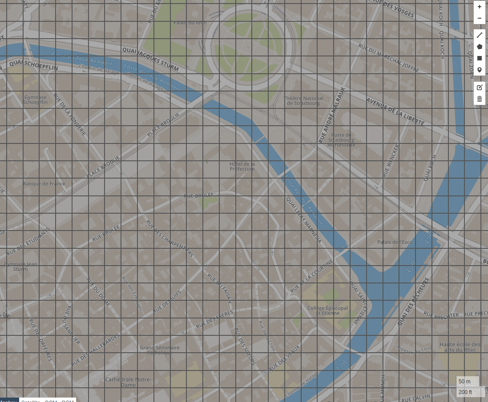
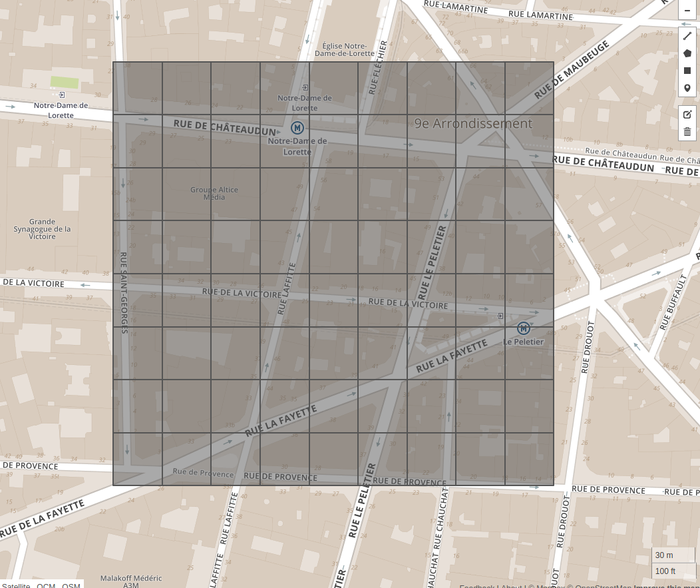

# sse-geo
Singlespot geospatial indexing system

## Overview
SSE is a geospatial indexing system based on an equal-area isolongitudinal grid.

We needed cells of equal area (in square meters, not square degrees), isolongitudinal for aesthetic reasons (so that layers stay vertically aligned) and as close as possible to squares, at least in a range of latitudes.

We chose an area of around 900m² (corresponding to a square of 30 meters size) and a reference latitude (46.852) at which cells will be squares, which gave us the constant longitudinal span to use (about 0.0003945°).

The sphere is then divided in longitudinal rings of constant width and the latitude width of all rectangular cells is computed so that all of them have the same area (900m²).

The conversion between the longitude and the longitude index is easy because the increment is constant. On the other hand the latitude is obtained by an integral calculation.


## Graphical representation
(Images from geojson.io)
* In Strasbourg

* 270m x 240m area in Paris


## Usage
* From latitude and longitude in degrees to cell and indexes
```python
cell = Cell.from_lat_lng(42.694218, 2.897399)
lat_index = cell.lat_index
# 210567
lon_index = cell.lon_index
# 7344
```
* From indexes to cell
```python
cell = Cell(210567, 7344)
```

* Coordinates
```python
# South-west point
cell.min_point
# (42.69420958354013, 2.8972589937107207)
# North-east point
cell.max_point
# (42.69446062197654, 2.897653500654309)
# Geojson coordinates
cell.geojson_coordinates
# [[2.8972589937107207, 42.69420958354013], [2.8972589937107207, 42.69446062197654], [2.897653500654309, 42.69446062197654], [2.897653500654309, 42.69420958354013], [2.8972589937107207, 42.69420958354013]]
```
